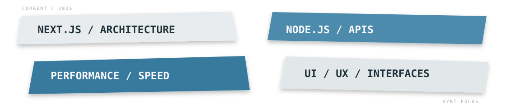

<p align="center">
  
</p>

<p align="center">
  <code>WEB</code>
  &nbsp;&nbsp;·&nbsp;&nbsp;
  <code>CODE</code>
  &nbsp;&nbsp;·&nbsp;&nbsp;
  <code>DESIGN</code>
  &nbsp;&nbsp;·&nbsp;&nbsp;
  <code>TECH</code>
</p>

<br/>

<p align="center">
  
</p>

```text
Vyrtral — Développeur web

> Création de projets web propres, rapides et faciles à maintenir.
> Front-end, back-end, interfaces et optimisation des performances.
> J’apprends en développant, en testant et en améliorant continuellement.
> Workflow assisté par l’IA avec Claude AI et Verdent AI.
```

<br/>

<p align="center">
  
</p>

<div align="center">

### Languages & Front-end


<br/><br/>

### Back-end & Data


<br/><br/>

### Tools


<br/><br/>

### AI Tools

<a href="https://claude.ai/">
  
</a>
<a href="https://www.verdent.ai/">
  
</a>

</div>

<br/>

<p align="center">
  
</p>

<div align="center">


<br/><br/>

<!--
Language summary cards are intentionally hidden for now.
They only become useful once public code repositories contain detectable languages.


<br/><br/>
-->


</div>

<br/>

<p align="center">
  
</p>

<p align="center">
  
</p>

<br/>

<p align="center">
  <a href="https://github.com/Vyrtral?tab=repositories">
    
  </a>
</p>
